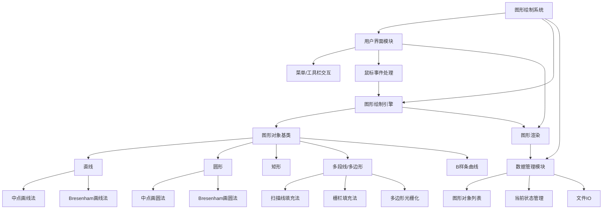
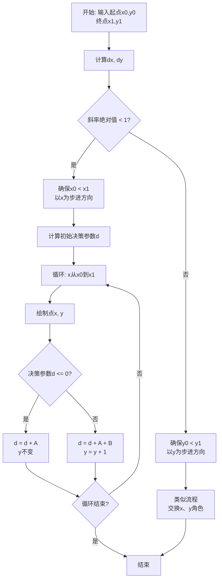
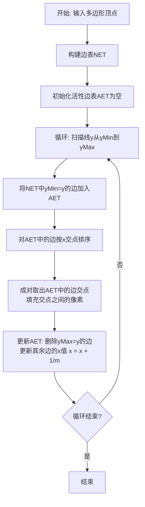

# 实验二 基本图形的生成

## 实验要求

### 1. 图形绘制软件功能设计

设计并实现一个简单的图形绘制软件，主要包括以下功能：

#### (1) 基本图形绘制
- 用户可通过点击菜单项或工具条按钮实现基本图形的绘制
- 支持的基本图形包括：
  - 直线
  - 曲线
  - 圆
  - 矩形
  - 多段线

**图形参数输入方式**：
- 通过鼠标交互输入图形参数
- 示例：直线绘制
  - 第一次点击鼠标左键确定起点
  - 移动鼠标
  - 第二次点击鼠标左键确定终点
  - 绘制出直线段
- 其他图形的绘制方式参照相关软件设计

#### (2) 直线绘制算法实现
添加菜单项或工具条按钮，分别采用以下算法实现直线段绘制：
- **中点法**
- **Bresenham算法**

#### (3) 圆绘制算法实现
添加菜单项或工具条按钮，分别采用以下算法实现圆的绘制：
- **中点法**
- **Bresenham算法**

#### (4) 区域填充算法实现
添加菜单项或工具条按钮，采用以下方法对封闭区域进行填充：
- **扫描线法**
- **栅栏填充法**

**支持的封闭区域类型**：
- 圆
- 矩形
- 用多段线绘制的闭合三角形
- 用多段线绘制的多边形

#### (5) 曲线绘制功能
添加菜单项或工具条按钮，实现：
- 通过多个控制点绘制连续的**B样条曲线**

---

## 实现说明

### 界面设计建议
- 主界面包含菜单栏和工具栏
- 绘制区域占据主要界面空间
- 算法选择可通过下拉菜单或独立按钮实现

### 交互流程
1. 用户选择要绘制的图形类型
2. 用户选择使用的算法（如适用）
3. 通过鼠标交互在绘制区域输入图形参数
4. 系统实时显示绘制结果

### 技术要求
- 实现基本的图形绘制引擎
- 封装不同的绘制算法
- 提供统一的图形绘制接口
- 支持图形预览和最终绘制

## **实验二：基本图形的生成**

### (1) 实验目的、任务及要求

**实验目的（5分）：**
1.  理解光栅图形学中基本图形（直线、圆、矩形）生成的原理。
2.  掌握中点画线法、Bresenham画线法、中点画圆法、Bresenham画圆法等经典扫描转换算法的思想与实现。
3.  掌握扫描线填充法和栅栏填充法的原理与实现。
4.  理解B样条曲线的概念，掌握其绘制方法。
5.  综合运用Windows GDI编程技术，设计并实现一个具有交互功能的图形绘制系统。

**实验任务及要求（5分）：**
1.  **任务**：设计并实现一个简单的图形绘制软件。
2.  **要求**：
    *   能够通过鼠标交互绘制直线、圆、矩形、多段线。
    *   提供菜单或工具栏，允许用户选择使用中点法或Bresenham法绘制直线和圆。
    *   提供菜单或工具栏，允许用户选择使用扫描线法或栅栏法填充封闭图形。
    *   能够通过鼠标放置控制点来生成连续的B样条曲线。
    *   程序必须基于提供的`main.cpp`框架进行扩展，保留原有功能。

### (2) 界面及交互方式设计（10分）

**界面设计：**
*   **主窗口**：包含菜单栏、工具栏、绘图区域。
*   **菜单栏**：
    *   `文件`：新建、打开、保存、退出。
    *   `绘制`：直线、圆、矩形、多段线、B样条曲线。
    *   `算法`：
        *   `直线算法`：中点法、Bresenham法。
        *   `圆算法`：中点法、Bresenham法。
        *   `填充算法`：扫描线法、栅栏法。
*   **工具栏**：包含“绘制”菜单下各项的图标按钮，方便快速切换。
*   **状态栏**：显示当前选中的绘制工具、算法以及鼠标坐标。

**交互方式：**
*   **基本图形（直线、圆、矩形）**：
    1.  用户从菜单/工具栏选择工具。
    2.  在绘图区**按下鼠标左键**确定起点（圆心、角点）。
    3.  **拖动鼠标**，实时显示图形预览。
    4.  **松开鼠标左键**确定终点（半径、对角点），完成绘制。
*   **多段线**：
    1.  选择多段线工具。
    2.  依次**单击左键**确定各个顶点。
    3.  **双击左键**或**单击右键**结束绘制。若首尾点重合，则形成封闭多边形。
*   **B样条曲线**：
    1.  选择B样条曲线工具。
    2.  依次**单击左键**放置控制点，每增加一个点，实时更新曲线预览。
    3.  **双击左键**或**单击右键**结束控制点输入，完成曲线绘制。
*   **图形填充**：
    1.  首先使用上述工具绘制一个**封闭图形**（如圆、矩形、封闭多段线）。
    2.  从菜单/工具栏选择填充算法。
    3.  在封闭图形内部**单击左键**，即可进行填充。

### (3) 功能模块结构图及说明（20分）



**功能说明：**
*   **用户界面模块**：负责与用户交互，接收指令并反馈结果。
*   **图形绘制引擎**：系统的核心，包含所有图形对象和绘制算法的实现。
*   **数据管理模块**：负责存储和管理所有已绘制的图形对象，以及程序的当前状态（如选择的工具、算法等）。

### (4) 算法程序流程图及说明（20分）

**以中点画线法为例：**



**算法说明：**
中点画线法通过计算中点与直线的相对位置来决策下一个像素点。它利用了一个决策参数 `d`，通过 `d` 的符号来决定选择哪个像素，并增量更新 `d`，从而避免了浮点运算，效率高。

**以扫描线填充算法为例：**



**算法说明：**
扫描线填充算法通过维护一个**边表(NET)** 和一个**活性边表(AET)** 来高效地确定扫描线与多边形的交点区间。它按扫描线从上到下处理，只在交点对之间进行填充，效率远优于简单的种子填充法。

### (5) 核心代码及其注释（25分）

**核心数据结构（示例）：**

```cpp
// 图形基类
class Shape {
public:
    COLORREF color; // 颜色
    virtual void Draw(HDC hdc) = 0; // 纯虚函数，用于绘制
    virtual void Fill(HDC hdc, int fillAlgorithm) = 0; // 纯虚函数，用于填充
    virtual ~Shape() {}
};

// 直线类
class Line : public Shape {
public:
    int x1, y1, x2, y2;
    int algorithm; // 0: Midpoint, 1: Bresenham

    void Draw(HDC hdc) override {
        if (algorithm == 0) {
            DrawLineMidpoint(hdc, x1, y1, x2, y2, color);
        } else {
            DrawLineBresenham(hdc, x1, y1, x2, y2, color);
        }
    }
    // ... Fill函数对于直线无意义，可空实现
};
```

**中点画线法核心代码：**

```cpp
void DrawLineMidpoint(HDC hdc, int x0, int y0, int x1, int y1, COLORREF color) {
    int dx = abs(x1 - x0);
    int dy = abs(y1 - y0);
    int sx = (x0 < x1) ? 1 : -1;
    int sy = (y0 < y1) ? 1 : -1;
    int err = dx - dy;
    int x = x0;
    int y = y0;

    while (true) {
        SetPixel(hdc, x, y, color); // 绘制当前像素点

        if (x == x1 && y == y1) break; // 到达终点，结束循环

        int e2 = 2 * err;
        if (e2 > -dy) { // 判断中点在直线的上方还是下方
            err -= dy;
            x += sx;
        }
        if (e2 < dx) {
            err += dx;
            y += sy;
        }
    }
}
```

**扫描线填充法核心代码（部分）：**

```cpp
// 边结构体
struct Edge {
    int yMax; // 边的最大y值
    float x;  // 当前扫描线与边的交点x坐标
    float slope; // 边的斜率的倒数 (1/m)
    Edge* next;
};

void ScanlineFill(HDC hdc, const std::vector<POINT>& vertices, COLORREF color) {
    // 1. 初始化边表NET
    std::map<int, Edge*> NET;
    // ... (构建NET的代码)

    // 2. 初始化活性边表AET
    Edge* AET = nullptr;

    // 3. 遍历每条扫描线
    for (int y = minY; y <= maxY; y++) {
        // 3.1 将NET中yMin == y的边插入AET
        if (NET.find(y) != NET.end()) {
            AET = MergeEdges(AET, NET[y]); // 合并链表
        }

        // 3.2 对AET按x排序（这里使用插入排序）
        // ... (排序代码)

        // 3.3 成对取出交点并填充
        Edge* p = AET;
        while (p && p->next) {
            for (int x = (int)ceil(p->x); x < p->next->x; x++) {
                SetPixel(hdc, x, y, color);
            }
            p = p->next->next;
        }

        // 3.4 更新AET：删除yMax == y的边，更新x
        UpdateAET(AET, y);
    }
}
```

### (6) 软件的用户使用说明（10分）

1.  **启动软件**：双击运行程序，主窗口出现。
2.  **选择绘制工具**：点击菜单栏中的`绘制`或工具栏上的图标，选择您要绘制的图形（如直线）。
3.  **选择算法**：点击菜单栏中的`算法`，为您选择的图形指定绘制算法（如`直线算法`->`中点法`）。
4.  **开始绘制**：
    *   **对于直线、圆、矩形**：在绘图区按下鼠标左键并拖动，松开后完成绘制。
    *   **对于多段线**：依次单击放置顶点，双击结束绘制。
    *   **对于B样条曲线**：依次单击放置控制点，双击结束绘制。
5.  **填充图形**：
    *   首先绘制一个封闭图形（如用多段线画一个三角形）。
    *   在`算法`菜单中选择一种填充算法（如`扫描线法`）。
    *   在封闭图形内部单击，即可完成填充。
6.  **保存/打开**：使用`文件`菜单中的`保存`和`打开`功能来保存您的作品或载入之前的作品。

### (7) 实验总结（5分）

通过本次实验，我深入理解了计算机图形学中基本图元生成和区域填充的核心算法。中点法和Bresenham法通过巧妙的整数运算避免了浮点数开销，体现了算法优化的精髓。扫描线填充算法通过NET和AET数据结构高效地解决了区域填充问题。

在实现过程中，我遇到了如何高效管理多种图形对象、如何处理复杂的鼠标交互逻辑等挑战。通过设计合理的类层次结构和状态管理机制，最终成功实现了所有功能。本次实验不仅锻炼了我的编程能力，更重要的是让我对光栅图形学的底层原理有了直观和深刻的认识，为后续学习更复杂的图形学技术打下了坚实的基础。

---
**请注意：** 以上代码和图表为示意性内容，在实际编写报告时，您需要根据您的具体代码实现进行详细阐述和绘制。特别是程序流程图和核心代码部分，务必与您的实际工作保持一致。