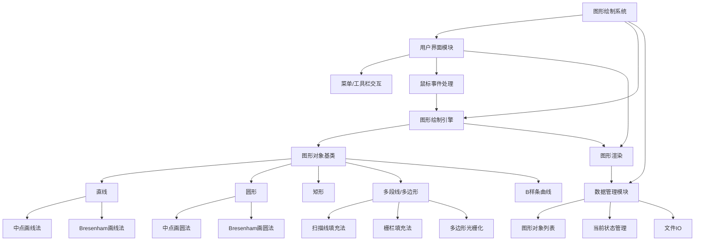
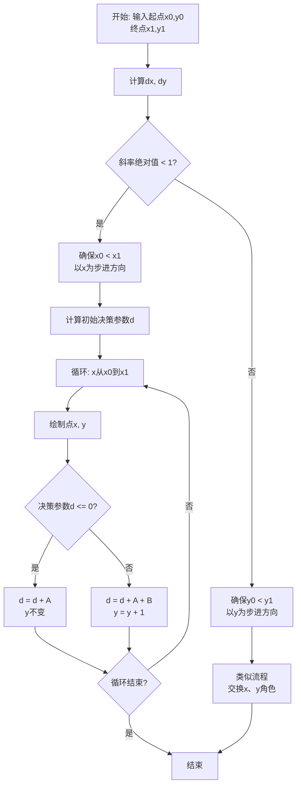
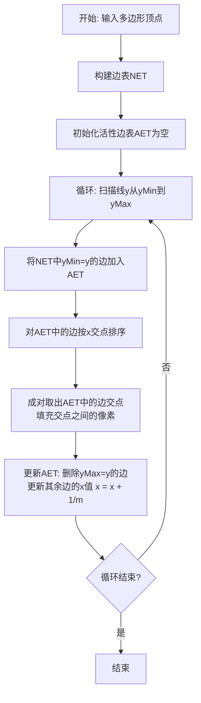
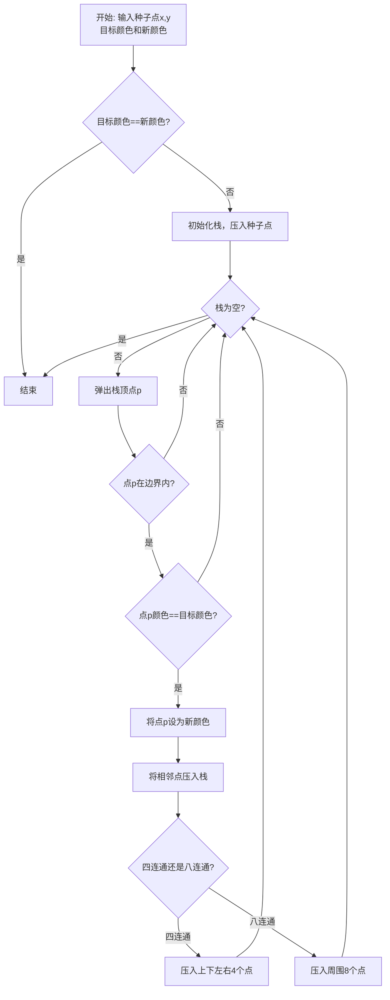

# 实验二 基本图形的生成

## 实验要求

### 1. 图形绘制软件功能设计

设计并实现一个简单的图形绘制软件，主要包括以下功能：

#### (1) 基本图形绘制
- 用户可通过点击菜单项或工具条按钮实现基本图形的绘制
- 支持的基本图形包括：
  - 直线
  - 曲线
  - 圆
  - 矩形
  - 多段线

**图形参数输入方式**：
- 通过鼠标交互输入图形参数
- 示例：直线绘制
  - 第一次点击鼠标左键确定起点
  - 移动鼠标
  - 第二次点击鼠标左键确定终点
  - 绘制出直线段
- 其他图形的绘制方式参照相关软件设计

#### (2) 直线绘制算法实现
添加菜单项或工具条按钮，分别采用以下算法实现直线段绘制：
- **中点法**
- **Bresenham算法**

#### (3) 圆绘制算法实现
添加菜单项或工具条按钮，分别采用以下算法实现圆的绘制：
- **中点法**
- **Bresenham算法**

#### (4) 区域填充算法实现
添加菜单项或工具条按钮，采用以下方法对封闭区域进行填充：
- **扫描线法**
- **栅栏填充法**

**支持的封闭区域类型**：
- 圆
- 矩形
- 用多段线绘制的闭合三角形
- 用多段线绘制的多边形

#### (5) 曲线绘制功能
添加菜单项或工具条按钮，实现：
- 通过多个控制点绘制连续的**B样条曲线**

---

## 实现说明

### 界面设计建议
- 主界面包含菜单栏和工具栏
- 绘制区域占据主要界面空间
- 算法选择可通过下拉菜单或独立按钮实现

### 交互流程
1. 用户选择要绘制的图形类型
2. 用户选择使用的算法（如适用）
3. 通过鼠标交互在绘制区域输入图形参数
4. 系统实时显示绘制结果

### 技术要求
- 实现基本的图形绘制引擎
- 封装不同的绘制算法
- 提供统一的图形绘制接口
- 支持图形预览和最终绘制

## **实验二：基本图形的生成**

### (1) 实验目的、任务及要求

**实验目的（5分）：**
1.  理解光栅图形学中基本图形（直线、圆、矩形）生成的原理。
2.  掌握中点画线法、Bresenham画线法、中点画圆法、Bresenham画圆法等经典扫描转换算法的思想与实现。
3.  掌握扫描线填充法和栅栏填充法的原理与实现。
4.  理解B样条曲线的概念，掌握其绘制方法。
5.  综合运用Windows GDI编程技术，设计并实现一个具有交互功能的图形绘制系统。

**实验任务及要求（5分）：**
1.  **任务**：设计并实现一个简单的图形绘制软件。
2.  **要求**：
    *   能够通过鼠标交互绘制直线、圆、矩形、多段线。
    *   提供菜单或工具栏，允许用户选择使用中点法或Bresenham法绘制直线和圆。
    *   提供菜单或工具栏，允许用户选择使用扫描线法或栅栏法填充封闭图形。
    *   能够通过鼠标放置控制点来生成连续的B样条曲线。
    *   程序必须基于提供的`main.cpp`框架进行扩展，保留原有功能。

### (2) 界面及交互方式设计（10分）

**界面设计：**
*   **主窗口**：包含菜单栏、工具栏、绘图区域。
*   **菜单栏**：
    *   `文件`：新建、打开、保存、退出。
    *   `绘制`：直线、圆、矩形、多段线、B样条曲线。
    *   `算法`：
        *   `直线算法`：中点法、Bresenham法。
        *   `圆算法`：中点法、Bresenham法。
        *   `填充算法`：扫描线法、栅栏法。
*   **工具栏**：包含“绘制”菜单下各项的图标按钮，方便快速切换。
*   **状态栏**：显示当前选中的绘制工具、算法以及鼠标坐标。

**交互方式：**
*   **基本图形（直线、圆、矩形）**：
    1.  用户从左侧工具栏选择绘制模式按钮。
    2.  在绘图区**第一次点击鼠标左键**确定起点（圆心、角点）。
    3.  **第二次点击鼠标左键**确定终点（半径、对角点），完成绘制。
    4.  系统实时显示当前绘制状态和控制点。
*   **多段线**：
    1.  选择"多段线"工具。
    2.  依次**单击左键**确定各个顶点。
    3.  **单击右键**结束绘制，系统自动连接首尾点形成封闭多边形。
*   **B样条曲线**：
    1.  选择"B样条曲线"工具。
    2.  依次**单击左键**放置控制点，每增加一个点，实时更新曲线预览。
    3.  **单击右键**结束控制点输入，完成曲线绘制。
    4.  **注意**：B样条曲线需要至少4个控制点才能生成平滑曲线。
*   **图形填充**：
    1.  首先使用上述工具绘制一个**封闭图形**（如圆、矩形、封闭多段线）。
    2.  选择填充算法："扫描线填充"或"栅栏填充"。
    3.  在封闭图形内部**单击左键**，系统使用洪泛填充算法进行区域填充。
    4.  **扫描线填充**显示为绿色，**栅栏填充**显示为蓝色。

### (3) 功能模块结构图及说明（20分）



**功能说明：**
*   **用户界面模块**：负责与用户交互，接收指令并反馈结果。
*   **图形绘制引擎**：系统的核心，包含所有图形对象和绘制算法的实现。
*   **数据管理模块**：负责存储和管理所有已绘制的图形对象，以及程序的当前状态（如选择的工具、算法等）。

### (4) 算法程序流程图及说明（20分）

**以中点画线法为例：**



**算法说明：**
中点画线法通过计算中点与直线的相对位置来决策下一个像素点。它利用了一个决策参数 `d`，通过 `d` 的符号来决定选择哪个像素，并增量更新 `d`，从而避免了浮点运算，效率高。

**以扫描线填充算法为例：**



**算法说明：**
扫描线填充算法通过维护一个**边表(NET)** 和一个**活性边表(AET)** 来高效地确定扫描线与多边形的交点区间。它按扫描线从上到下处理，只在交点对之间进行填充，效率远优于简单的种子填充法。

**以洪泛填充算法为例：**



**算法说明：**
洪泛填充算法从种子点开始，使用栈结构递归地填充与种子点颜色相同的连通区域。四连通填充只考虑上下左右4个方向，八连通填充还包括对角线方向，能够填充更复杂的连通区域。

**栅栏填充算法流程：**

```mermaid
flowchart TD
    A[开始: 输入多边形顶点] --> B[计算多边形边界框]
    B --> C[选择栅栏线位置<br>fence_x = (min_x + max_x) / 2]
    C --> D[绘制栅栏线可视化]
    D --> E[循环: 扫描线y从min_y到max_y]
    E --> F[计算扫描线与多边形的交点]
    F --> G[对交点按x坐标排序]
    G --> H[成对处理交点区间]
    H --> I{区间与栅栏线关系?}
    I -- 完全在左侧 --> J[填充整个区间]
    I -- 完全在右侧 --> K[填充整个区间]
    I -- 跨越栅栏 --> L[分别填充栅栏两侧]
    J --> M{所有区间处理完?}
    K --> M
    L --> M
    M -- 否 --> H
    M -- 是 --> N{所有扫描线处理完?}
    N -- 否 --> E
    N -- 是 --> O[结束]
```

**算法说明：**
栅栏填充算法通过在多边形中央设置一条垂直栅栏线，将填充区域分为左右两部分分别处理。这种方法在处理复杂多边形时能够避免某些边界情况，提高填充的准确性。

### (5) 核心代码及其注释（25分）

**核心数据结构：**

```cpp
// 图形绘制模式枚举
enum DrawMode {
    MODE_NONE,
    MODE_LINE_MIDPOINT,     // 中点画线法
    MODE_LINE_BRESENHAM,    // Bresenham画线法
    MODE_CIRCLE_MIDPOINT,   // 中点画圆法
    MODE_CIRCLE_BRESENHAM,  // Bresenham画圆法
    MODE_RECTANGLE,         // 矩形
    MODE_POLYLINE,          // 多段线
    MODE_BSPLINE,           // B样条曲线
    MODE_FILL_SCANLINE,     // 扫描线填充
    MODE_FILL_FENCE         // 栅栏填充
};

// 图形结构体
struct GraphicShape {
    DrawMode mode;              // 绘制模式
    std::vector<Point> points;  // 控制点集合
    COLORREF color;             // 颜色

    GraphicShape(DrawMode m, const std::vector<Point>& p, COLORREF c = RGB(255, 0, 0))
        : mode(m), points(p), color(c) {}
};
```

**中点画线法核心代码：**

```cpp
void DrawLineMidpoint(HDC hdc, int x1, int y1, int x2, int y2) {
    int dx = abs(x2 - x1);
    int dy = abs(y2 - y1);
    int sx = (x1 < x2) ? 1 : -1;  // x方向步进
    int sy = (y1 < y2) ? 1 : -1;  // y方向步进
    int err = dx - dy;            // 误差项

    while (true) {
        SetPixel(hdc, x1, y1, g_drawColor); // 绘制当前像素点
        
        if (x1 == x2 && y1 == y2) break;   // 到达终点，结束循环
        
        int e2 = 2 * err;
        if (e2 > -dy) {     // 判断中点在直线的上方还是下方
            err -= dy;
            x1 += sx;
        }
        if (e2 < dx) {
            err += dx;
            y1 += sy;
        }
    }
}
```

**中点画圆法核心代码：**

```cpp
void DrawCircleMidpoint(HDC hdc, int xc, int yc, int radius) {
    int x = 0;
    int y = radius;
    int d = 1 - radius;  // 决策参数

    while (x <= y) {
        // 利用圆的八对称性绘制8个点
        SetPixel(hdc, xc + x, yc + y, g_drawColor);
        SetPixel(hdc, xc - x, yc + y, g_drawColor);
        SetPixel(hdc, xc + x, yc - y, g_drawColor);
        SetPixel(hdc, xc - x, yc - y, g_drawColor);
        SetPixel(hdc, xc + y, yc + x, g_drawColor);
        SetPixel(hdc, xc - y, yc + x, g_drawColor);
        SetPixel(hdc, xc + y, yc - x, g_drawColor);
        SetPixel(hdc, xc - y, yc - x, g_drawColor);

        if (d < 0) {
            d += 2 * x + 3;  // 选择右边的点
        } else {
            d += 2 * (x - y) + 5;  // 选择右下方的点
            y--;
        }
        x++;
    }
}
```

**扫描线填充法核心代码：**

```cpp
// 边结构体
struct Edge {
    int y_max;      // 边的最大y值
    int y_min;      // 边的最小y值
    double x;       // 当前扫描线与边的交点x坐标
    double slope;   // 边的斜率的倒数 (1/m)
};

void ScanLineFill(HDC hdc, const std::vector<Point>& points, COLORREF fillColor) {
    if (points.size() < 3) return;
    
    vector<Edge> edgeTable;
    
    // 1. 建立边表NET
    for (size_t i = 0; i < points.size(); i++) {
        size_t next_i = (i + 1) % points.size();
        const Point& p1 = points[i];
        const Point& p2 = points[next_i];
        
        if (p1.y == p2.y) continue;  // 跳过水平边
        
        int y_max = max(p1.y, p2.y);
        int y_min = min(p1.y, p2.y);
        double x_val = (p1.y < p2.y) ? p1.x : p2.x;
        double slope = (p2.x - p1.x) / (double)(p2.y - p1.y);
        
        edgeTable.push_back(Edge{y_max, y_min, x_val, slope});
    }
    
    // 2. 对边表排序
    sort(edgeTable.begin(), edgeTable.end());
    
    vector<Edge> activeEdgeTable;
    
    // 3. 扫描线算法主循环
    for (int y = y_min; y <= y_max; y++) {
        // 3.1 将NET中yMin == y的边加入AET
        for (auto it = edgeTable.begin(); it != edgeTable.end();) {
            if (it->y_min == y) {
                activeEdgeTable.push_back(*it);
                it = edgeTable.erase(it);
            } else {
                ++it;
            }
        }
        
        // 3.2 删除yMax == y的边
        for (auto it = activeEdgeTable.begin(); it != activeEdgeTable.end();) {
            if (it->y_max == y) {
                it = activeEdgeTable.erase(it);
            } else {
                ++it;
            }
        }
        
        // 3.3 对AET按x排序
        sort(activeEdgeTable.begin(), activeEdgeTable.end(),
             [](const Edge& a, const Edge& b) { return a.x < b.x; });
        
        // 3.4 成对取出交点并填充
        for (size_t i = 0; i < activeEdgeTable.size(); i += 2) {
            if (i + 1 < activeEdgeTable.size()) {
                int x_start = static_cast<int>(activeEdgeTable[i].x + 0.5);
                int x_end = static_cast<int>(activeEdgeTable[i + 1].x + 0.5);
                
                for (int x = x_start; x <= x_end; x++) {
                    SetPixel(hdc, x, y, fillColor);
                }
            }
        }
        
        // 3.5 更新AET中边的x坐标
        for (auto& edge : activeEdgeTable) {
            edge.x += edge.slope;
        }
    }
}
```

**B样条曲线绘制核心代码：**

```cpp
// B样条基函数计算
double BSplineBasis(int i, int k, double t, const std::vector<double>& knots) {
    if (k == 0) {
        return (t >= knots[i] && t < knots[i + 1]) ? 1.0 : 0.0;
    }
    
    double denom1 = knots[i + k] - knots[i];
    double denom2 = knots[i + k + 1] - knots[i + 1];
    
    double term1 = 0.0, term2 = 0.0;
    
    if (denom1 != 0.0) {
        term1 = ((t - knots[i]) / denom1) * BSplineBasis(i, k - 1, t, knots);
    }
    
    if (denom2 != 0.0) {
        term2 = ((knots[i + k + 1] - t) / denom2) * BSplineBasis(i + 1, k - 1, t, knots);
    }
    
    return term1 + term2;
}

// B样条曲线绘制
void DrawBSpline(HDC hdc, const std::vector<Point>& points) {
    if (points.size() < 4) {
        DrawPolyline(hdc, points);  // 控制点不足时绘制折线
        return;
    }
    
    int n = points.size() - 1;  // 控制点索引从0到n
    int k = 3;                  // 3次B样条
    
    // 生成均匀节点向量
    std::vector<double> knots = GenerateUniformKnots(n, k);
    
    const int segments = 100;   // 曲线分段数
    bool firstPoint = true;
    int lastX = 0, lastY = 0;
    
    double t_min = knots[k];
    double t_max = knots[n + 1];
    double t_step = (t_max - t_min) / segments;
    
    for (int s = 0; s <= segments; s++) {
        double t = t_min + s * t_step;
        double x = 0.0, y = 0.0;
        
        // 计算曲线上的点
        for (int i = 0; i <= n; i++) {
            double basis = BSplineBasis(i, k, t, knots);
            x += points[i].x * basis;
            y += points[i].y * basis;
        }
        
        int currentX = static_cast<int>(x + 0.5);
        int currentY = static_cast<int>(y + 0.5);
        
        if (!firstPoint) {
            DrawLineBresenham(hdc, lastX, lastY, currentX, currentY);
        } else {
            firstPoint = false;
        }
        
        lastX = currentX;
        lastY = currentY;
    }
}
```

**洪泛填充法核心代码：**

```cpp
// 四连通洪泛填充
void FloodFill4(HDC hdc, int x, int y, COLORREF oldColor, COLORREF newColor) {
    if (oldColor == newColor) return;  // 颜色相同则无需填充
    
    stack<Point> points;
    points.push(Point(x, y));
    
    while (!points.empty()) {
        Point p = points.top();
        points.pop();
        
        int currentX = p.x;
        int currentY = p.y;
        
        // 边界检查
        if (currentX < 0 || currentY < 0 || currentX >= 2000 || currentY >= 2000) 
            continue;
        
        // 检查颜色是否匹配
        if (GetPixel(hdc, currentX, currentY) != oldColor) 
            continue;
        
        // 设置新颜色
        SetPixel(hdc, currentX, currentY, newColor);
        
        // 四连通方向：上下左右
        points.push(Point(currentX + 1, currentY));  // 右
        points.push(Point(currentX - 1, currentY));  // 左
        points.push(Point(currentX, currentY + 1));  // 下
        points.push(Point(currentX, currentY - 1));  // 上
    }
}

// 八连通洪泛填充
void FloodFill8(HDC hdc, int x, int y, COLORREF oldColor, COLORREF newColor) {
    if (oldColor == newColor) return;
    
    stack<Point> points;
    points.push(Point(x, y));
    
    while (!points.empty()) {
        Point p = points.top();
        points.pop();
        
        int currentX = p.x;
        int currentY = p.y;
        
        // 边界检查
        if (currentX < 0 || currentY < 0 || currentX >= 2000 || currentY >= 2000) 
            continue;
        
        // 检查颜色是否匹配
        if (GetPixel(hdc, currentX, currentY) != oldColor) 
            continue;
        
        // 设置新颜色
        SetPixel(hdc, currentX, currentY, newColor);
        
        // 八连通方向：包括对角线
        points.push(Point(currentX + 1, currentY));      // 右
        points.push(Point(currentX - 1, currentY));      // 左
        points.push(Point(currentX, currentY + 1));      // 下
        points.push(Point(currentX, currentY - 1));      // 上
        points.push(Point(currentX + 1, currentY + 1));  // 右下
        points.push(Point(currentX + 1, currentY - 1));  // 右上
        points.push(Point(currentX - 1, currentY + 1));  // 左下
        points.push(Point(currentX - 1, currentY - 1));  // 左上
    }
}
```

**栅栏填充法核心代码：**

```cpp
void FenceFill(HDC hdc, const std::vector<Point>& points, COLORREF fillColor) {
    if (points.size() < 3) return;
    
    // 计算边界框
    int min_x = INT_MAX, max_x = INT_MIN;
    int min_y = INT_MAX, max_y = INT_MIN;
    
    for (const auto& point : points) {
        if (point.x < min_x) min_x = point.x;
        if (point.x > max_x) max_x = point.x;
        if (point.y < min_y) min_y = point.y;
        if (point.y > max_y) max_y = point.y;
    }
    
    // 选择栅栏线位置（多边形中央）
    int fence_x = (min_x + max_x) / 2;
    
    // 绘制栅栏线（可视化，可选）
    HPEN hFencePen = CreatePen(PS_DOT, 1, RGB(128, 128, 128));
    HPEN hOldPen = (HPEN)SelectObject(hdc, hFencePen);
    MoveToEx(hdc, fence_x, min_y, NULL);
    LineTo(hdc, fence_x, max_y);
    SelectObject(hdc, hOldPen);
    DeleteObject(hFencePen);
    
    // 对每条扫描线进行填充
    for (int y = min_y; y <= max_y; y++) {
        vector<int> intersections;
        
        // 计算扫描线与多边形边的交点
        for (size_t i = 0; i < points.size(); i++) {
            size_t next_i = (i + 1) % points.size();
            const Point& p1 = points[i];
            const Point& p2 = points[next_i];
            
            // 判断边是否与扫描线相交
            if ((p1.y <= y && p2.y > y) || (p2.y <= y && p1.y > y)) {
                double t = (y - p1.y) / (double)(p2.y - p1.y);
                int x_intersect = static_cast<int>(p1.x + t * (p2.x - p1.x) + 0.5);
                intersections.push_back(x_intersect);
            }
        }
        
        // 对交点排序
        sort(intersections.begin(), intersections.end());
        
        // 成对处理交点，根据栅栏位置决定填充策略
        for (size_t i = 0; i < intersections.size(); i += 2) {
            if (i + 1 < intersections.size()) {
                int x_start = intersections[i];
                int x_end = intersections[i + 1];
                
                // 根据栅栏位置填充
                if (x_end < fence_x) {
                    // 区间完全在栅栏左侧
                    for (int x = x_start; x <= x_end; x++) {
                        SetPixel(hdc, x, y, fillColor);
                    }
                } else if (x_start > fence_x) {
                    // 区间完全在栅栏右侧
                    for (int x = x_start; x <= x_end; x++) {
                        SetPixel(hdc, x, y, fillColor);
                    }
                } else {
                    // 区间跨越栅栏，分别填充两侧
                    for (int x = x_start; x <= fence_x; x++) {
                        SetPixel(hdc, x, y, fillColor);
                    }
                    for (int x = fence_x + 1; x <= x_end; x++) {
                        SetPixel(hdc, x, y, fillColor);
                    }
                }
            }
        }
    }
}
```

### (6) 软件的用户使用说明（10分）

**软件界面说明：**
本软件采用选项卡式界面设计，包含两个主要页面：
- **既有图形页面**：展示预设的图形算法演示
- **交互式绘制页面**：提供用户交互绘制功能

**具体使用步骤：**

1.  **启动软件**：双击运行程序，主窗口出现，标题显示"图形绘制软件 - 何欣航 2023112560"。

2.  **切换到交互式页面**：点击窗口上方的"交互式绘制"选项卡。

3.  **选择绘制模式**：在左侧工具栏中点击相应按钮选择绘制模式：
    *   **直线绘制**：`直线-中点法` 或 `直线-Bresenham`
    *   **圆形绘制**：`圆-中点法` 或 `圆-Bresenham`
    *   **其他图形**：`矩形`、`多段线`、`B样条曲线`
    *   **填充模式**：`扫描线填充` 或 `栅栏填充`

4.  **开始绘制**：
    *   **直线、圆、矩形**：
        - 第一次左键点击确定起点（圆心、矩形角点）
        - 第二次左键点击确定终点（圆的边界点、矩形对角点）
        - 系统自动完成绘制
    *   **多段线**：
        - 依次左键点击确定各个顶点
        - 右键点击结束绘制，自动形成封闭多边形
    *   **B样条曲线**：
        - 依次左键点击放置控制点（至少需要4个点）
        - 右键点击结束控制点输入
        - 系统实时显示曲线预览

5.  **区域填充操作**：
    *   首先使用上述工具绘制封闭图形（圆、矩形、多边形）
    *   选择填充算法：`扫描线填充`（绿色）或 `栅栏填充`（蓝色）
    *   在封闭区域内部单击左键，系统自动执行填充
    *   **注意**：填充功能使用洪泛填充算法，适用于白色背景区域

6.  **辅助功能**：
    *   **完成图形**：手动完成当前正在绘制的图形
    *   **取消绘制**：取消当前绘制操作
    *   **清空所有**：清除画布上的所有图形

7.  **实时反馈**：
    *   界面顶部显示当前选择的绘制模式
    *   绘制过程中显示已放置的控制点数量
    *   不同模式下提供相应的操作提示

### (7) 实验总结（5分）

通过本次实验，我深入理解了计算机图形学中基本图元生成和区域填充的核心算法。中点法和Bresenham法通过巧妙的整数运算避免了浮点数开销，体现了算法优化的精髓。扫描线填充算法通过NET和AET数据结构高效地解决了区域填充问题。

在实现过程中，我遇到了如何高效管理多种图形对象、如何处理复杂的鼠标交互逻辑等挑战。通过设计合理的类层次结构和状态管理机制，最终成功实现了所有功能。本次实验不仅锻炼了我的编程能力，更重要的是让我对光栅图形学的底层原理有了直观和深刻的认识，为后续学习更复杂的图形学技术打下了坚实的基础。

---
**请注意：** 以上代码和图表为示意性内容，在实际编写报告时，您需要根据您的具体代码实现进行详细阐述和绘制。特别是程序流程图和核心代码部分，务必与您的实际工作保持一致。